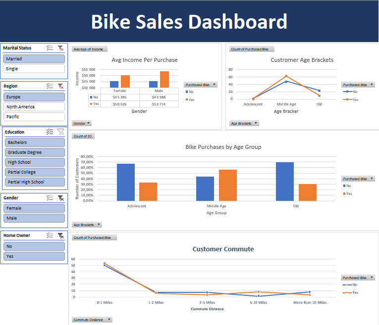
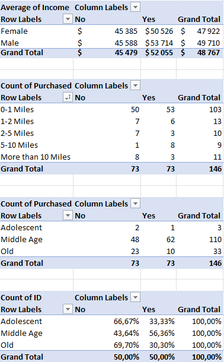

# Bike Buyers Analysis - Excel Project

A data analysis project built in Microsoft Excel, using a real-world dataset of ~1,000 customers to explore which demographic and lifestyle factors influence bike purchases.

---

## 📊 Project Overview

This project demonstrates core Excel skills applied to a customer dataset containing variables such as income, age, commute distance, education, and occupation.
The goal was to clean the data, summarize it with pivot tables, and build an interactive dashboard to surface key insights.

---

## 📁 Dataset

The dataset (`bike_buyers.xlsx`) contains ~1,000 customer records with the following columns:

| Column | Description |
|---|---|
| `ID` | Unique customer identifier |
| `Marital Status` | Married (M) or Single (S) |
| `Gender` | Male (M) or Female (F) |
| `Income` | Annual income in USD |
| `Children` | Number of children |
| `Education` | Highest education level |
| `Occupation` | Job category |
| `Home Owner` | Whether the customer owns a home |
| `Cars` | Number of cars owned |
| `Commute Distance` | Daily commute range (e.g. 0–1 Miles) |
| `Region` | Europe / Pacific / North America |
| `Age` | Customer age |
| `Purchased Bike` | Target variable — Yes / No |

---

## 🛠️ Excel Skills Demonstrated

- **Data cleaning & Transformation** - Standardized categorical values (converting 'M'/'S' to Married/Single, 'M'/'F' to Male/Female), removed duplicates, and created custom Age Brackets using logical formulas to improve segment analysis
- **Pivot Tables** - summarizing purchase rates by income bracket, age group, commute distance, and region
- **Charts** - bar and line charts linked to pivot tables
- **Dashboard** - consolidated view with slicers for interactive filtering
- **Conditional formatting** - highlighting key patterns in the data

---

## 📸 Screenshots

### Dashboard

### Pivot Tables

---

## 💡 Key Insights

- Customers with shorter commute distances (0-1 miles) were more likely to purchase a bike
- **Middle-income** customers showed the highest purchase rates compared to low and high earners
- **Middle Age (31-54)** had the highest conversion to bike buyers
- Single customers purchased bikes at a slightly higher rate than married ones

---

## 🧰 Tools Used

- Microsoft Excel (Pivot Tables,Charts,Slicers,Dashboard)

---

## 👤 Author

**Václav Benda**

